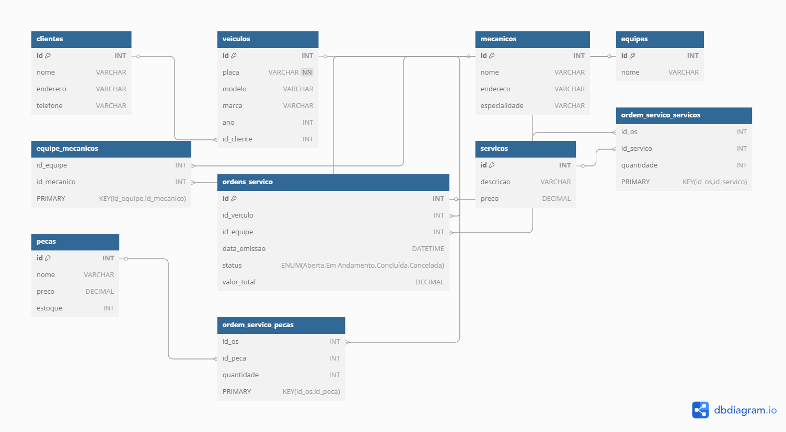

# 🛠 Sistema de Gerenciamento de Oficina Mecânica

  
(*Oficina diagrama ER*)

## 📖 Descrição
Este projeto foi desenvolvido para criar um banco de dados para um sistema de controle e gerenciamento de ordens de serviço em uma oficina mecânica. O banco de dados gerencia clientes, veículos, mecânicos, equipes, serviços e peças utilizadas.

## 📂 Estrutura do Banco de Dados
O banco de dados contém as seguintes entidades principais:

- **Clientes**: Informações dos clientes da oficina.
- **Veículos**: Cadastro de veículos dos clientes.
- **Mecânicos**: Profissionais responsáveis pelos serviços.
- **Equipes**: Agrupamento de mecânicos.
- **Ordens de Serviço (OS)**: Registra a execução dos serviços.
- **Serviços**: Tipos de serviços realizados.
- **Peças**: Controle de peças utilizadas nos serviços.

## 🔍 Consultas SQL Implementadas
- Listagem de ordens de serviço por cliente.
- Serviços executados por ordem de serviço.
- Mecânicos de cada equipe.
- Peças utilizadas em cada ordem de serviço.

## 🚀 Como Utilizar
1. Execute o script SQL para criar o banco de dados.
2. Popule as tabelas com os dados de exemplo.
3. Utilize as queries fornecidas para explorar as informações.

## 📷 Diagrama ER

## 🛠 Tecnologias Utilizadas
- **MySQL** para a estrutura e manipulação do banco de dados.
- **dbdiagram.io** para modelagem do diagrama ER.
- **GitHub** para versionamento do projeto.

## 📌 Autor
Este projeto foi desenvolvido para fins acadêmicos e aprendizado em modelagem de banco de dados.
